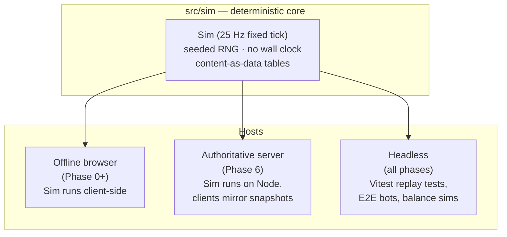
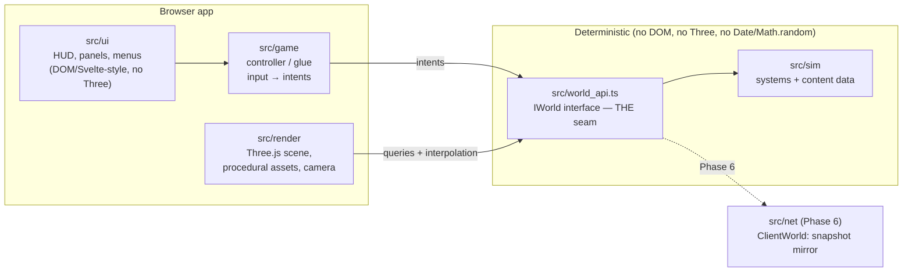

# Architecture Overview

> Status: canonical. Every other architecture doc refines a section of this one.

## What we are building

A browser-based action RPG that is **mechanically exact** to Diablo II: Resurrected's systems
(loot generation, skill trees with synergies, frame-based speed breakpoints, difficulty tiers)
with **fully original content** (names, story, maps, art, audio), rendered in real 3D with an
isometric-plus-zoom camera. Architecture is adapted from the proven
[world-of-claudecraft](https://github.com/levy-street/world-of-claudecraft) model:
**one deterministic sim, multiple hosts**.

## One sim, three hosts

A single deterministic game core runs unchanged in three contexts:



- **Offline browser** — the default product. The whole game runs in the tab; saves in IndexedDB.
- **Authoritative server** — Phase 6. Same sim on Node; clients become renderers of snapshots.
- **Headless** — determinism replay tests, drop-rate statistical tests, bot-driven E2E runs.

## Module map



Directory layout (target state):

```
src/
  sim/            # deterministic core — the game
    systems/      # combat, loot, ai, movement, skills, quests…
    data/         # content-as-data tables (see data-model.md)
    rng.ts        # seeded streams
    sim.ts        # Sim implements IWorld
  world_api.ts    # IWorld + shared DTO types — the only seam
  game/           # input mapping, intent building, session flow
  render/         # Three.js renderer, procedural meshes/textures, camera
  ui/             # HUD + panels (DOM), reads IWorld snapshots via game layer
  net/            # Phase 6: ClientWorld implements IWorld over WebSocket
server/           # Phase 6: Node host + Postgres persistence
headless/         # test/bot entry points
doc/              # this documentation suite
```

## Load-bearing invariants

These are enforced by lint rules and tests; breaking one is a bug regardless of behavior:

1. **The renderer never touches a concrete world.** `src/render` and `src/ui` import only
   `world_api.ts` types. Swapping `Sim` for `ClientWorld` must be invisible.
2. **The sim is deterministic.** Fixed 25 Hz tick; one seeded RNG module with named streams;
   no `Math.random`, `Date.now`, `performance.now`, or DOM APIs inside `src/sim`.
   Same seed + same intent log ⇒ bit-identical world state. See `determinism.md`.
3. **25 Hz is not negotiable.** All game mechanics (attack/cast/hit-recovery speed, poison,
   open wounds) are defined in 25 fps frames, exactly like the source mechanics. One sim tick
   = one mechanics frame. Breakpoint tables are used natively. See `determinism.md`.
4. **Content is data.** Items, affixes, treasure classes, monsters, skills, zones live in typed
   data tables under `src/sim/data`, never in code branches. See `data-model.md`.
5. **Assets are procedural.** No binary model/texture/audio files in the repo. Meshes are
   generated geometry, textures are canvas-painted, audio is WebAudio-synthesized.
   See `rendering.md`.
6. **Original IP only.** No Blizzard names, text, maps, art, or audio anywhere — mechanics,
   formulas, and layout conventions only. Enforced by the IP-audit checklist in
   `doc/05-implementation/testing-strategy.md`.

## Frame loop

Render runs at display rate; sim runs at fixed 25 Hz via accumulator; renderer interpolates
entity transforms between the last two sim states.

```
requestAnimationFrame:
  acc += dt (clamped to 250 ms)
  while acc >= 40 ms: world.advance(); acc -= 40 ms   # consumes intents queued via submit()
  alpha = acc / 40
  render.draw(world, alpha)   # interpolated positions
```

`advance()` is the seam's public advance method (see `world-seam.md`); intents are queued
beforehand with `world.submit()`.

### Threading

The sim runs on the **main thread** through Phase 5. Budget math: a worst-case tick must fit
the 8 ms sim slice (`performance-budget.md`), and at 25 Hz only ~2.5 ticks land per 60 fps
frame window — no contention at target scale. Moving the sim to a Web Worker stays an open,
seam-compatible option (the `IWorld` calls become postMessage pairs) if profiling ever shows
tick work starving the renderer; zone generation MAY be offloaded to a worker earlier since
it is pure and seedable. Any worker seam must still pass through `world_api.ts` types only.

## Technology choices

| Concern | Choice | Why |
|---|---|---|
| Language | TypeScript (strict) | Shared types across sim/render/server |
| Rendering | Three.js | Proven in world-of-claudecraft at this scope |
| UI | DOM overlay (lightweight; Svelte optional later) | D2-style panel UI is document-shaped, not scene-shaped |
| Build | Vite | Fast dev, worker + code-split support |
| Tests | Vitest | Headless sim tests, deterministic replays |
| Lint/format | Biome | Single fast tool |
| Persistence (offline) | IndexedDB + exportable JSON save | See `save-persistence.md` |
| Server (Phase 6) | Node + WebSocket + Postgres (JSONB) | Mirrors WoC's proven stack |

## Reading order for the rest of `01-architecture/`

1. `determinism.md` — tick, RNG, replay
2. `world-seam.md` — the `IWorld` contract
3. `simulation-runtime.md` — entity store, collision, pathfinding, LOS, missiles, AI
4. `world-generation.md` — zone procgen, placement passes, automap
5. `data-model.md` — content table schemas
6. `rendering.md` — Three.js pipeline + procedural assets
7. `graphics-plan.md` — visual-quality tiers, lighting/post, G0…G11 roadmap (layers on rendering.md)
8. `camera.md` — isometric + zoom + limited orbit
9. `save-persistence.md` — save format and versioning
10. `performance-budget.md` — frame/memory/draw-call budgets
11. `networking-future.md` — Phase 6 authoritative server design
