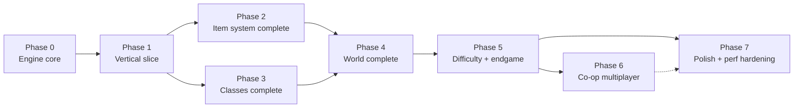

# Implementation Phases — Overview

> Eight phases, each ending in a playable/testable state. Docs are canon: a phase begins by
> reading its phase doc + the game-design docs it implements; it ends when exit criteria are
> demonstrably met (tests + manual checklist).

## Dependency graph

P2 and P3 can proceed in parallel after P1 (item engine vs skill content are separable —
they meet at "+skills" affixes, sequenced inside P3).

## Phase summaries

| Phase | Delivers | Playable state at exit |
|---|---|---|
| **0 — Engine core** | repo scaffold, 25 Hz sim loop, RNG streams, `IWorld` seam, camera rig, click-to-move locomotion, procedural terrain slice, perf/replay harnesses | walk a character around a generated zone at 60 fps; golden replay test green |
| **1 — Vertical slice** | 1 town + 3-zone chain + mini-boss; 2 classes with 1 tree each; melee+missile+spell combat; monsters w/ AI + champion mods; loot v1 (magic/rare, potions, gold); inventory/equip/belt; vendor+heal; death/respawn; save/load | the core loop is *fun*: kill → loot → equip → deeper |
| **2 — Item system complete** | full affix tables, sets/uniques, sockets+gems+runes+words, cube recipes+crafting, gambling, stash, MF math, treasure-class engine at full fidelity, identify/scrolls | loot endgame exists in miniature; drop-sim statistical tests green |
| **3 — Classes complete** | all 7 classes × 3 trees, synergies, +skills items, respec, hireling v1 | every archetype build-viable to slice content |
| **4 — World complete** | all 5 acts (original zones per content bible), quest engine + all quest lines, waypoints complete, act bosses, superuniques, shrines, hirelings full | Normal difficulty completable start→finish |
| **5 — Difficulty + endgame** | Nightmare/Hell analogs w/ penalties+immunities, TC upgrades, xp curve to 99, alvl85-style farming zones, boss-key event chain, balance pass | the 500-hour loop exists |
| **6 — Co-op multiplayer** | Node authoritative server, lobbies (8p), Postgres persistence, trade, players-count scaling | two browsers clear a dungeon together |
| **7 — Polish** | audio synthesis, fx pass, accessibility, settings, onboarding, perf hardening to final budgets | shippable quality |

## Cross-phase rules

- **Testing strategy applies from Phase 0** (`testing-strategy.md`): golden replays, data
  validation, perf scene run every phase.
- **No phase pulls future content forward** without editing the phase docs first.
- **Every phase updates**: `CLAUDE.md` commands section, `doc/README.md` if docs moved,
  migrations if saves changed.
- **Definition of done for any task**: code + tests + docs updated + demo note in PR.

## Suggested session-sizing (AI-agent development)

Each phase doc breaks work into tasks sized to one focused working session with review
gates between. Order within a phase is dependency-sorted; tasks marked `[P]` are safely
parallelizable across agents/worktrees.
