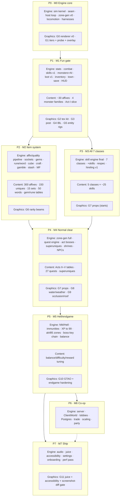

# Master Implementation Roadmap

> The single index over all implementation work. Eight phases (P0–P7) map one-to-one onto
> eight milestones (M0–M7); each milestone is a **playable state behind a hard gate**. This
> doc is the master view; the per-phase docs (`phase-0-engine-core.md` … `phase-7-polish.md`)
> are the detail. Docs are canon — a phase begins by reading its phase doc + the game-design
> docs it implements, and ends only when every CI gate here is green. See `phases.md` for the
> dependency rationale and `testing-strategy.md` for what each gate actually asserts.
>
> **Three lanes run through every phase:** an **Engine/systems** lane (sim + seam code), a
> **Content-authoring** lane (typed data tables per the content bible — invariant 5), and a
> **Graphics** lane (steps `G0…G11` from `../01-architecture/graphics-plan.md`, each
> independently landable and screenshot-verifiable). A milestone lands only when all three
> lanes for its phase have landed and the acceptance-gate row (§4) is green.

CI job legend used below: **lint** (Biome + sim-purity + import-boundary + banned-API),
**replay** (golden replays), **formula** (golden formula/breakpoint), **data**
(`tests/data` validation), **stat** (statistical drop/quality distributions), **e2e**
(headless-bot scripts), **perf** (headless perf scene vs `performance-budget.md`), **ip**
(IP audit — `scripts/ip-audit.mjs`), **size** (bundle-size check).

---

## 1. Milestones M0–M7

| Milestone | Delivers | Playable state | Gate (one-liner) | Enforcing CI jobs | Doc |
|---|---|---|---|---|---|
| **M0 — Engine core** | scaffold · 25 Hz sim · RNG streams · `IWorld` seam · host loop · zone-gen v0 · click-to-move · perf/replay harnesses | walk a character around a generated zone at 60 fps | 60 fps walk; golden replay #1 green; determinism gate live | lint · replay · perf · ip · size | [phase-0](phase-0-engine-core.md) |
| **M1 — Fun gate** | stats · combat · 2 classes/1 tree · monsters+AI · loot v1 · inventory/belt · vendor · death/save · HUD v1 | kill → loot → equip → deeper, in miniature | the fun gate — 3 playtesters voluntarily replay the dungeon | formula · data · stat · e2e · replay · perf · ip | [phase-1](phase-1-vertical-slice.md) |
| **M2 — Item system** | full affixes · uniques · sets · sockets · gems · rune/word analogues · cube · crafting · gamble · stash · MF | loot endgame in miniature; target-farm loop exists | drop-sim stats at 0.99 confidence; every item within ±5% of budget | data · stat · formula · e2e · perf · ip | [phase-2](phase-2-item-system.md) |
| **M3 — All 7 classes** | 7 classes × 3 trees · synergies · +skills · respec · hireling v1 | every archetype build-viable through slice content | all 7 classes distinct; synergy math exact; ≤ 220 entities in AoI | replay · formula · e2e · perf · ip | [phase-3](phase-3-classes-complete.md) |
| **M4 — Normal clear** | all 5 acts · quest engine · act bosses · superuniques · waypoints · shrines · full roster/hirelings | Normal difficulty completable start → finish | Normal beatable start→finish; 27 quests reward correctly; no dead-ends | data · replay · e2e · stat · perf · ip | [phase-4](phase-4-world-complete.md) |
| **M5 — Hell/endgame** | NM/Hell + penalties/immunities · TC upgrades · XP to 99 · alvl85 zones · boss-key chain · balance pass | the 500-hour loop exists | Hell act-5 kill with ≥ 10 builds; XP curve to 99; endgame loop closed | formula · stat · e2e · replay · perf · ip | [phase-5](phase-5-difficulty-endgame.md) |
| **M6 — Co-op** | authoritative Node server · 8-player lobbies · Postgres persistence · trade · players-count scaling · party | two browsers clear a dungeon together | two browsers co-op a dungeon; players-count 1–8 matches tables; offline replays still pass | e2e · stat · replay · perf · ip | [phase-6](phase-6-multiplayer.md) |
| **M7 — Ship** | audio synthesis · fx/juice · accessibility · settings · onboarding · final perf hardening | shippable quality | no silent actions; budgets green; no setting can touch determinism | perf · replay · e2e · ip · size | [phase-7](phase-7-polish.md) |

---

## 2. Three workstream lanes per phase

Each phase runs the three lanes in parallel to a shared gate. Content-authoring sizes below are
the backlog totals for that phase (see `../06-review/gap-analysis.md` for current authored %).
Graphics-step slots are fixed by `../01-architecture/graphics-plan.md` §8.

| Phase | Engine / systems lane | Content-authoring backlog (sizes) | Graphics steps |
|---|---|---|---|
| **P0** | repo scaffold · sim kernel (tick, entity store, intents) · RNG streams · `fixedmath` · `world_api.ts` v1 seam · host loop + interpolation · zone-gen v0 · pathing v0 · camera rig · replay + perf harnesses | — (dev-zone only; no content rows) | **G0** renderer v0 (Lambert, vertex-color terrain, blob shadows, no composer) · **G1** `gfx.ts` tiers + `?lowgfx=1` + auto-downgrade probe + `?perf=1` overlay |
| **P1** | stats engine · combat core (hit order, damage pipeline, frame breakpoints) · skill engine v1 (6 mechanic keys) · monster engine + AI archetypes · TC/loot v1 · grid inventory/equip/belt · town + vendor + quest template · death/save-load · HUD + panels v1 | **~30 affixes** · **4 monster families** (rusher/kiter/caster/swarm) · **Act-I slice** (3-zone chain + mini-boss) | **G2** texture kit (painters, height-to-normal, 4-layer splat, `themeAt`) · **G3** post stack (HDR, MSAA 4×, bloom, GradeShader) · **G4** IBL (procedural sky → PMREM, three-light rig) · **G5** entity rigs + material factory (≤ 40 programs, champion tint) |
| **P2** | full affix/quality-roll pipeline · unique/set budgets · sockets · gems · rune analogue · word analogue · cube-recipe engine · crafting families · gambling · stash tabs · MF pipeline | **~300 affixes** · **150 uniques** · **15 sets** · **~50 word-analogues** · gem + rune stat tables (6 families × 6 tiers × 3 contexts) | **G6** rarity ground-item beams (HDR emissive cores ×2.5, bloom-catching, label sync) |
| **P3** | skill engine final form (all mechanic keys: summon/curse/aura/warcry/shapeshift/trap/charge/teleport/corpse-consumer/passives) · 7 classes × 3 trees · +skills/o-skills wiring · respec · hireling v1 | **5 classes × ~25 skills** numeric authoring (progression bands, prereqs, synergy web) | **G7** prop system (`InstancedMesh` >3×, per-chunk merge, wind sway + HSL jitter) — spans P3→P4 |
| **P4** | full zone generators (per `generatorKey`) · Acts 1–5 zone graphs · quest engine (27 quests) · 5 act bosses · full monster roster · superuniques · shrines · hirelings complete · full NPC set | **Acts II–V mechanical tables** (alvl/WP/TC/monster-set) · **27 quests** (descriptions + reward map) · **~25 superuniques** · remaining uniques/monster variants | **G7** (cont.) · **G8** water + per-act palette themes + weather emitters · **G9** occlusion + roof system (dither-fade, blocked-outline, roof collapse) |
| **P5** | difficulty tiers (NM −40 / Hell −100, immunities, 1/5 breaks) · TC upgrades · XP curve 1–99 · alvl85 farming zones · boss-key event chain · immunity-break charm analogue · zone-rotation event · balance pass | **balance fill**: difficulty resist/XP tables · immunity spread across families · endgame reward stat budgets · per-build speed tuning | **G10** GTAO (ultra) + endgame perf hardening (worst-case brawl holds 350-draw / 1.5 M-tri) |
| **P6** | netcode scaffold (WS + MessagePack) · `ClientWorld` (delta snapshots, interpolation, move-prediction replay) · lobby + host migration · Postgres persistence · atomic trade · players-count scaling · party · optional duel | — (multiplayer is additive; no new content rows) | — (feature parity; no new G-step — all G0–G10 render paths reused unchanged) |
| **P7** | WebAudio synthesis engine · visual juice (damage numbers, hit flash, death fx, skill fx, pickup) · accessibility · settings persistence · onboarding + menus · final perf pass · credits | **audio/fx tuning**: per-element sfx palettes · rarity drop-chime timbres · per-effect toggles + costs | **G11** juice + accessibility (colorblind-LUT → GradeShader, Reduce-motion caps, grain/vignette tune, **screenshot-diff regression gate**) |

---

## 3. Phase / lane dependency graph

Phase order is `P0 → P1 → {P2 ∥ P3} → P4 → P5 → {P6 ∥ P7}`. P2 (item engine) and P3 (skill
content) are separable after P1 and rejoin at P4. Each phase node below bundles the three lanes
that must land together for its milestone.

---

## 4. Acceptance-gate index

One row per milestone; every listed gate must be green in CI before the milestone lands. Details
of each fixture/budget live in `testing-strategy.md`; graphics budgets reconcile against
`../01-architecture/performance-budget.md` (it wins). The **ip** gate (`scripts/ip-audit.mjs`)
and **lint/sim-purity** run on every milestone without exception and are omitted from the table.

| Milestone | Golden replay fixture | Golden formula | Perf scene budget | Data validation (`tests/data`) | Statistical (drop/quality) |
|---|---|---|---|---|---|
| **M0** | `walk-around.json` (10k ticks) | rng/math/pathing unit | v0: 500 static + 50 walking dummies; fps proxy · draws · heap | — (no content rows) | — |
| **M1** | `walk` · `slice-brawl` · slice speedrun | AR/CTH/EHP + IAS/FCR/FHR breakpoints | combat load added | itemBases · affixes · monsters · zones (slice subsets) | 100k-kill quality/affix distribution |
| **M2** | `loot-scenario.json` (seeded rolls) | alvl/quality 128th math | item-heavy scene | itemBases · affixes · treasureClasses (full, acyclic) | 1M-roll affix histogram · MF curves · gambler odds |
| **M3** | `class-skills.json` ×7 classes | synergy hard-point contribution | player + hireling + 8 summons ≤ 220 entities | skills (prereq acyclic, tier-monotonic, synergy refs) | — |
| **M4** | `act-complete.json` (Act-1 clear) | quest-reward + boss-ability tables | all zone types · final-act peak density | zones (reachable, acyclic) · quests (chain valid) | monster balance curve per act |
| **M5** | `hell-endgame.json` | XP-curve + immunity-break thresholds | max-endgame load; p95 within budget | difficulty (resist ≤ 0, XP penalty ≤ 1.0) | alvl85 drop-sim · headless speedrun benchmarks |
| **M6** | `multiplayer.json` · **all offline replays still pass** | players-count `(n+1)/2` HP/XP + XP-share | 8 clients/lobby at 25 Hz sustained on server | (reuse; save schema identical to offline) | players-count NoDrop 1/3/5/7 breakpoints |
| **M7** | all replays **unchanged by any graphics setting** | — | final budgets green; `?perf=1` p95 < 14 ms; **G11 screenshot-diff baseline** | (full suite, unchanged) | audio node-count < 32; mixing ≤ 0.2 ms/frame |

---

## Cross-phase rules (apply to every milestone)

These hold at all eight gates and are not repeated in the per-milestone rows above.

- **Testing strategy applies from M0.** Golden replays, data validation, and the perf scene run
  every phase from Phase 0 onward (`testing-strategy.md`), growing fixtures as systems land — a
  later milestone never drops an earlier milestone's fixtures.
- **Determinism is non-negotiable.** Every milestone re-asserts: same seed + same intent log ⇒
  bit-identical state; named-stream RNG only; no banned APIs in `src/sim` (invariant 2). A
  replay-hash change in a non-mechanics PR is a failure; an intentional mechanics change
  re-records in the same PR with justification and a doc edit first.
- **The seam stays clean.** `src/world_api.ts` remains the only render/ui/game → world import;
  view DTOs stay JSON-serializable (invariants 4, 7). This is what makes M6 (co-op) additive
  rather than a rewrite — the M6 gate literally re-runs the M4/M5 offline replays unchanged.
- **Content is data.** New rows land as typed tables in `src/sim/data/` validated by `tests/data`
  (invariant 5); systems never special-case content ids. Balance outliers carry a PR note.
- **Graphics never regresses low-end.** Every `G`-step is gated behind `gfx.ts`, re-runs the perf
  scene before landing, and never alters a view DTO, a sim result, or a golden replay
  (`../01-architecture/graphics-plan.md` §8). Assets stay procedural — no binary files (invariant 6).
- **No pulling future work forward.** A phase never implements a later phase's system or content
  without editing the phase docs first (docs are canon). Saves that change shape bump `v` and ship
  a migration + golden fixture (invariant 8).
- **Definition of done, every task:** code + tests + docs updated + a demo note in the PR. Every
  phase also updates the `CLAUDE.md` commands section and `doc/README.md` if docs moved.
- **Parallelization.** Within a phase, dependency-sorted tasks marked `[P]` in the phase docs are
  safe to run across agents/worktrees. Across phases, the only true fork is `{P2 ∥ P3}` after M1
  and `{P6 ∥ P7}` after M5 (§3); everything else is a hard sequence.

---

## 5. Status cursor — 2026-07-08

**Stage A complete, Phase 0 in progress.**

- **Done — design consolidation + roadmap.** The full documentation suite is ship-ready per
  `../06-review/gap-analysis.md` (56 docs + 4 interactive HTML, ~12,150 lines; architecture and
  game-design rated exceptional, no gaps block Phase 0). This master roadmap (Stage A5) is the
  last consolidation deliverable: milestones M0–M7, the three-lane breakdown, the dependency
  graph, and the acceptance-gate index are now the canonical index over the phase docs.
- **Active — Phase 0 engine core (M0), tasks 0.1–0.7.** Repo scaffold → sim kernel → world seam
  → host loop → zone-gen v0 + terrain render → character + click-to-move → test/perf harnesses.
  Exit target: a character walks a procedurally generated zone at 60 fps with the
  determinism, replay, and perf gates all live in CI (golden replay #1 green, banned-API and
  import-boundary lint enforced, IP audit clean). No content, combat, or UI beyond the dev HUD —
  scope discipline is part of the M0 exit.
- **Next — Phase 1 (M1) after M0 exit.** Content authoring opens with the P1 backlog (~30
  affixes, 4 monster families, the Act-I slice); graphics steps G2–G5 slot in alongside. The fun
  gate governs: if three playtesters do not voluntarily replay the dungeon, tune before calling
  the milestone.

> Update rule: this cursor is the one mutable section. Advance it at each milestone exit; keep
> §1–§4 in sync with the phase docs (docs are canon — edit the phase doc first, then this index).
